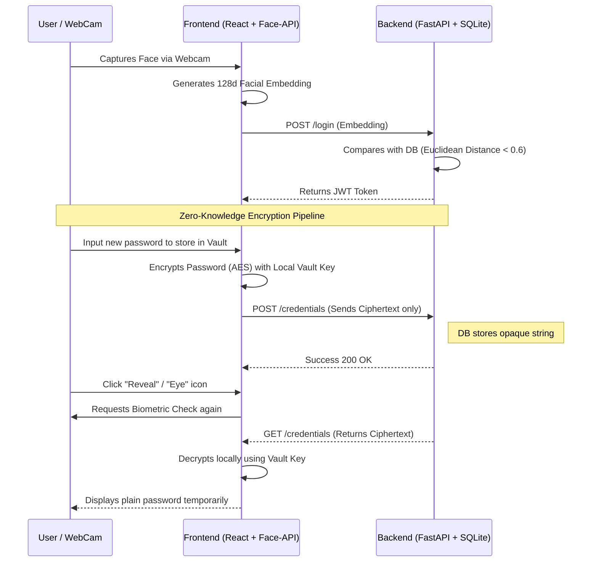

<div align="center">
  
  <h1>Biometri System Vault</h1>
  <p><strong>A Zero-Knowledge Password Manager secured by Facial Recognition</strong></p>
  
  
  
  
  
  
</div>

<br/>

## 🔐 About The Project

**Biometri System Vault** is a high-security, full-stack password manager designed with strict privacy principles and futuristic authentication. Instead of traditional master passwords, it utilizes **Face-API.js** to map 128-dimensional facial embeddings for primary authentication and critical operations verification.

Built for a portfolio showcase, this project enforces **Zero-Knowledge Architecture**. The backend database *never* receives plain-text passwords; all symmetric encryption and decryption pipelines are executed directly in the client's browser (Frontend) using AES standard via `crypto-js`.

### ✨ Key Features
- **Biometric Enforcement:** Deleting or Revealing passwords prompts the webcam for Liveness/Facial checks before allowing execution.
- **Zero-Knowledge Proof:** The backend stores pure ciphertext. The API creator cannot read your passwords even if the database is breached.
- **Secure Password Generator:** Built-in pseudo-random complex string generation.
- **Docker Ready:** Full infrastructure-as-code orchestration using Docker Compose.

---

## 🏗️ Architecture & Security Flow

Below is the diagram illustrating the authentication and zero-knowledge encryption pipelines:



## 🚀 Getting Started

To spin up the entire application mimicking a production-like environment on your local machine, ensure you have **Docker** and **Docker Compose** installed.

1. **Clone the repository:**
   ```bash
   git clone https://github.com/your-username/biometri-system.git
   cd biometri-system
   ```

2. **Run the Docker cluster:**
   ```bash
   docker-compose up --build
   ```

3. **Access the Application:**
   Open your browser and navigate to:
   * **Frontend Application:** `http://localhost:3000`
   * **Backend API Documentation:** `http://localhost:8000/docs`

> **Note:** The camera module operates within the browser. ensure you grant webcam permissions when prompted on the initial load. Localhost allows webcam usage due to browser secure context rules.

---

## 🛠️ Stack Components

*   **Frontend Environment:** Vite, React 19, Lucide React (Icons), Axios, Crypto-JS.
*   **Computer Vision:** face-api.js (SSD MobileNet V1, 68 Point Face Landmark).
*   **Backend Environment:** Python 3.11, FastAPI, SQLAlchemy, SQLite, python-jose (JWT).

## 📄 Licensing & Disclaimer
This project was constructed as a robust Proof-of-Concept for portfolio purposes, showcasing modern full-stack web defense practices. Do not use this as your primary password manager for sensitive bank details without further continuous security audits.
